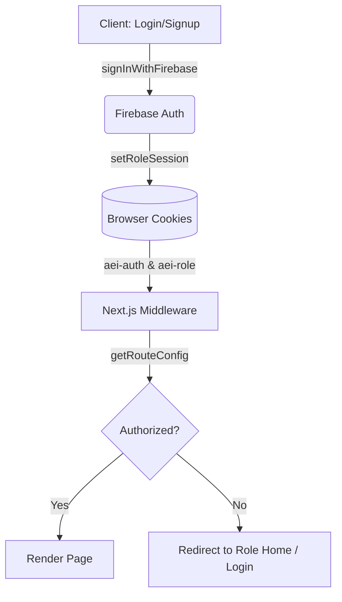

# Authentication & Authorization

# Authentication & Authorization

The Authentication & Authorization module provides a secure, role-based identity system using Firebase Authentication combined with Next.js server-side middleware. It handles user registration, login, password recovery, session management, and Role-Based Access Control (RBAC) across the application.

## Architecture Overview

The system bridges client-side Firebase authentication with server-side Next.js route protection. Because Next.js middleware cannot directly access client-side Firebase states, the module synchronizes authentication state into HTTP-only compatible cookies (`aei-auth` and `aei-role`).

## Key Components

### 1. Client-Side Authentication (`src/lib/auth-client.ts`)
This file wraps Firebase Auth methods and manages the synchronization between Firebase and browser cookies.
*   **`signInWithFirebase` & `signUpWithFirebase`**: Authenticates the user via Firebase and immediately calls `setRoleSession` to establish the server-side session. It also normalizes custom claims via `normalizeClaimRole` to ensure the role matches the `AppRole` type (`STUDENT`, `TEACHER`, `PARENT`).
*   **`setRoleSession`**: Writes the `AUTH_COOKIE` (`aei-auth`) and `ROLE_COOKIE` (`aei-role`) to the browser.
*   **`getCurrentIdToken`**: Retrieves the current Firebase JWT. This is heavily utilized by the backend client (`buildHeaders`) to authenticate outgoing API requests (e.g., to billing endpoints).
*   **`signOutFromFirebase`**: Clears both the Firebase session and the local authentication cookies via `clearAuthCookies`.

### 2. Route Authorization (`src/lib/route-auth.ts`)
Handles the logic for determining if a user can access a specific path based on their role.
*   **`getRouteConfig`**: Looks up a normalized path against the central `appRoutes` configuration.
*   **`isRoleAllowedForPath`**: Evaluates if a given `AppRole` is permitted to access a route. If a route has no specific `roles` defined, it defaults to allowing access.

### 3. Next.js Middleware (`src/middleware.ts`)
The middleware intercepts all incoming requests (excluding static assets and APIs) to enforce security rules before rendering.
*   Reads `AUTH_COOKIE` and `ROLE_COOKIE`.
*   Redirects authenticated users away from auth pages (`/login`, `/auth/signup`, `/auth/forgot-password`) to their respective dashboards using `getRoleHome`.
*   Redirects unauthenticated users attempting to access protected routes (`requireAuth: true`) to `/login`, appending a `?next=` parameter for post-login redirection.
*   Enforces RBAC: If an authenticated user attempts to access a route restricted to a different role, they are redirected to their role's home page with a `?denied=` parameter.

### 4. React Hooks (`src/hooks/useAuthUser.ts`)
*   **`useAuthUser`**: A client-side hook that subscribes to Firebase's `onAuthStateChanged`. It provides `{ user, loading, error }` to components that need real-time user data. It is widely used across settings, support, and billing pages to verify active client sessions.

## User Interfaces

The module provides three primary entry points under `src/app/`:

*   **Login (`/login`)**: Captures email, password, and an expected role. On successful authentication, it uses `resolveDestination` to route the user. `resolveDestination` checks for a `?next=` parameter, validates it against `isRoleAllowedForPath`, and falls back to `getRoleHome` if the requested path is unauthorized or missing.
*   **Signup (`/auth/signup`)**: Allows users to create an account, explicitly selecting their `AppRole`. It enforces an 8-character password minimum and policy acceptance before calling `signUpWithFirebase`.
*   **Forgot Password (`/auth/forgot-password`)**: A simple interface that triggers `sendResetEmail` via Firebase.

## Execution Flows

### Authentication to Backend API Flow
When the application needs to communicate with secure backend services (like the Billing API), the auth module provides the necessary tokens:
1. A protected page (e.g., `BillingCheckoutPage`) initiates an action.
2. The API client calls `buildHeaders` (`src/lib/backend-client.ts`).
3. `buildHeaders` invokes `getCurrentIdToken(false)` from `src/lib/auth-client.ts`.
4. The Firebase JWT is attached as a Bearer token to the outgoing request.

### Login Redirection Flow
1. User submits credentials on `/login`.
2. `handleSignIn` calls `signInWithFirebase`.
3. `signInWithFirebase` validates credentials, extracts the role from Firebase claims (falling back to the UI-selected role if necessary), and sets cookies.
4. `resolveDestination` normalizes the target path using `normalizePath`.
5. `isRoleAllowedForPath` checks if the resolved role can access the target path.
6. The router pushes the user to the validated destination.