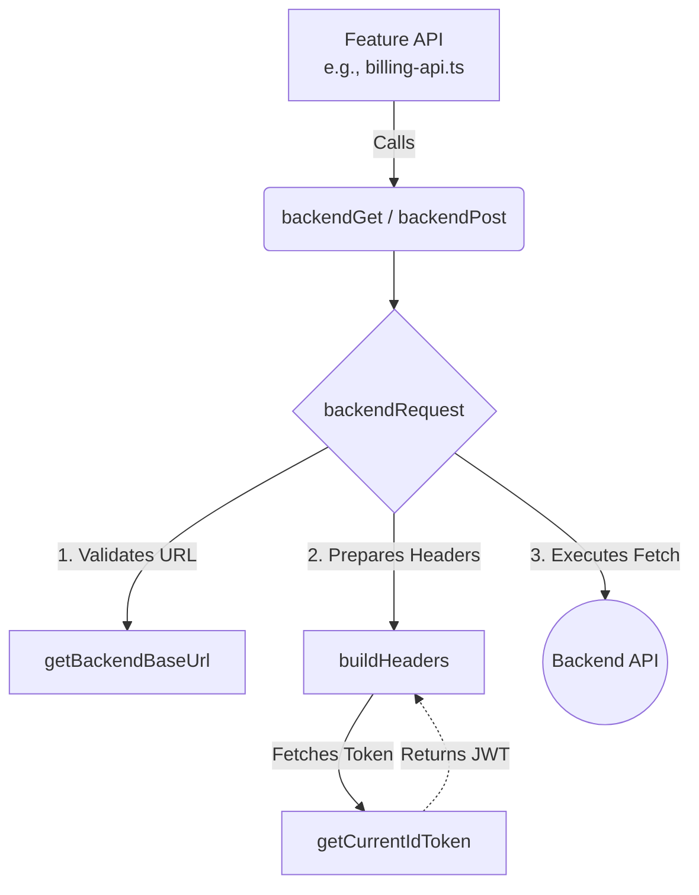

# Backend & Infrastructure

# Backend & Infrastructure

The Backend & Infrastructure module provides the foundational utilities for external communication in the application. It handles authenticated HTTP requests to the backend API, initializes Firebase services, and provides structured mock data for UI development and testing.

## Core Components

### Backend Client (`src/lib/backend-client.ts`)

The backend client is a robust wrapper around the native `fetch` API, designed to standardize API interactions, handle timeouts, and automatically inject Firebase authentication tokens.

**Key Functions:**
*   **`backendRequest<T>(path, options)`**: The core request handler. It manages the `AbortController` for timeouts (defaulting to 15,000ms), constructs headers, and parses the response. It automatically handles `204 No Content` responses and parses others as JSON.
*   **`backendGet<T>(path, options)`**: Convenience wrapper for `GET` requests.
*   **`backendPost<T>(path, body, options)`**: Convenience wrapper for `POST` requests. Automatically stringifies the `body` payload.

**Authentication Injection:**
By default, all requests expect an authenticated user. The `buildHeaders` function intercepts the request and calls `getCurrentIdToken()` (from `src/lib/auth-client.ts`). If a token is found, it is attached as a `Bearer` token in the `Authorization` header. 
*To bypass this for public endpoints, developers must explicitly pass `requireAuth: false` in the `BackendRequestOptions`.*

**Configuration:**
The client relies on the `NEXT_PUBLIC_API_BASE_URL` environment variable. The `getBackendBaseUrl()` function ensures this is present and formats it correctly (stripping trailing slashes) before appending the request path.

### Firebase Client (`src/lib/firebase-client.ts`)

This file manages the singleton initialization of the Firebase SDK, ensuring it plays nicely with Next.js hot-reloading and environment configurations.

*   **Initialization Logic**: It validates the presence of all required `NEXT_PUBLIC_FIREBASE_*` environment variables via the `isFirebaseConfigured` boolean. 
*   **App Instantiation**: If configured, it checks `getApps().length` to either retrieve the existing instance or initialize a new one using `initializeApp()`.
*   **Exports**: Exposes `db` (Firestore) and `firebaseAuth` (Firebase Auth). Note that these exports will be `null` if the environment variables are missing, which prevents the app from crashing during build steps or in environments where Firebase is intentionally disabled.

### Mock Data (`src/lib/mock-data.ts`)

Provides static, typed datasets used for prototyping UI components without requiring a live backend connection. 

*   **Types**: `SubjectMetric`, `InterventionItem`, `ParentNotification`.
*   **Datasets**: 
    *   `studentSubjectMetrics`: Mastery scores for various subjects.
    *   `teacherInterventions`: Actionable alerts for teachers regarding student progress.
    *   `parentNotifications`: Status updates and achievements for the parent dashboard.
    *   `parentTrend`: Weekly score progressions.

## Request Execution Flow

The backend client is heavily utilized by feature-specific APIs (such as the Billing API). When a user interacts with a feature that requires backend data, the request flows through the client to ensure authentication and configuration are applied uniformly.

### Example Flow: Billing Checkout
As seen in the execution graph, when a user completes a checkout session:
1. `BillingCheckoutPage` triggers `completeBillingCheckoutSession` in `src/lib/billing-api.ts`.
2. The Billing API calls `backendPost("/billing/checkout/complete", ...)`.
3. `backendRequest` initializes a 15-second timeout.
4. `buildHeaders` requests the current Firebase JWT via `getCurrentIdToken`.
5. The fully authenticated request is dispatched to the backend URL defined in `NEXT_PUBLIC_API_BASE_URL`.