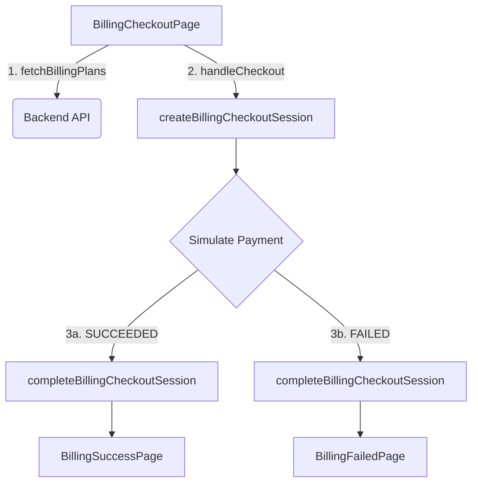

# Billing & Payments

# Billing & Payments

The Billing & Payments module handles the user-facing checkout flow, subscription plan selection, and payment session management. It currently implements a simulated payment provider to verify end-to-end billing wiring before integrating an external payment gateway (like Stripe or Razorpay).

## Architecture & Execution Flow

The checkout process is entirely session-based. A user selects a plan, provides billing details, and creates a checkout session. The session is then completed (simulated as success or failure), and the user is redirected accordingly.

All backend communication in this module relies on `backendGet` and `backendPost` from `src/lib/backend-client.ts`. These utilities automatically intercept the request to attach the user's Firebase authentication token via `getCurrentIdToken()`.

## Key Components

### 1. Checkout Flow (`src/app/billing/checkout/page.tsx`)
The `BillingCheckoutPage` is the primary entry point for the module. It requires an authenticated user (enforced via the `useAuthUser` hook).

**State Management:**
*   **`plans`**: Populated on mount via `fetchBillingPlans()`.
*   **`draft`**: A `BillingDraft` object tracking user inputs (name, email, address, discount code, and `BillingPaymentMethod`).
*   **`session`**: Holds the `BillingCheckoutSessionSummary` once a checkout session is successfully created.

**Key Functions:**
*   `sanitizeInput(value, maxLength)`: Strips `<` and `>` characters and truncates strings to prevent basic injection before sending data to the backend.
*   `handleCheckout()`: Validates the `draft` state, sanitizes all inputs, and calls `createBillingCheckoutSession()`. If successful, it transitions the UI to the payment simulation step.
*   `handleComplete(status)`: Accepts `"SUCCEEDED"` or `"FAILED"`. It calls `completeBillingCheckoutSession()` to update the backend state, then routes the user to `/billing/success` or `/billing/failed` with the `sessionId` appended as a URL parameter.

### 2. Status Pages (`src/app/billing/success/page.tsx` & `src/app/billing/failed/page.tsx`)
Both `BillingSuccessPage` and `BillingFailedPage` follow an identical architectural pattern:
1.  Extract the `session` ID from the URL search parameters (`?session=...`).
2.  Wait for the `useAuthUser` hook to confirm authentication.
3.  Fetch the session details using `getBillingCheckoutSession(sessionId)`.
4.  Display the session status, plan name, and total amount.

The success page provides a call-to-action to continue to the `/student/dashboard`, while the failure page allows the user to retry the checkout.

### 3. API Client (`src/lib/billing-api.ts`)
This file defines the data contracts and API wrapper functions for the billing domain.

**Core Data Models:**
*   `BillingPlan`: Represents an available subscription (e.g., `starter`, `school_pro`, `enterprise`), including its `monthlyAmountInr` and `seatLimit`.
*   `BillingCheckoutSessionSummary`: The central entity for the checkout process. It tracks the `status` (`CREATED`, `SUCCEEDED`, `FAILED`), financial calculations (`subtotalAmountInr`, `discountAmountInr`, `totalAmountInr`), and the `checkoutProvider` (currently hardcoded to `"SIMULATED"`).

**API Methods:**
*   `fetchBillingPlans()`: Retrieves available plans via `GET /api/billing/plans`.
*   `createBillingCheckoutSession(payload)`: Initializes a new payment attempt via `POST /api/billing/checkout`.
*   `getBillingCheckoutSession(sessionId)`: Fetches the status of an existing session via `GET /api/billing/checkout/{sessionId}`.
*   `completeBillingCheckoutSession(sessionId, payload)`: Finalizes the simulated payment via `POST /api/billing/checkout/{sessionId}/complete`.

## Security & Data Integrity

*   **Authentication Requirement:** Every page in this module uses `useAuthUser()`. If `user` is null, API calls are bypassed, and the UI prompts the user to sign in.
*   **Cross-Community Auth Flow:** When `createBillingCheckoutSession` or `completeBillingCheckoutSession` is invoked, the execution flow traverses through `backendPost` -> `backendRequest` -> `buildHeaders` -> `getCurrentIdToken`. This ensures that every billing action is cryptographically tied to the active Firebase session.
*   **Input Sanitization:** The `sanitizeInput` function in the checkout page ensures that address lines, names, and discount codes are stripped of HTML tags and strictly length-bound before hitting the API client.