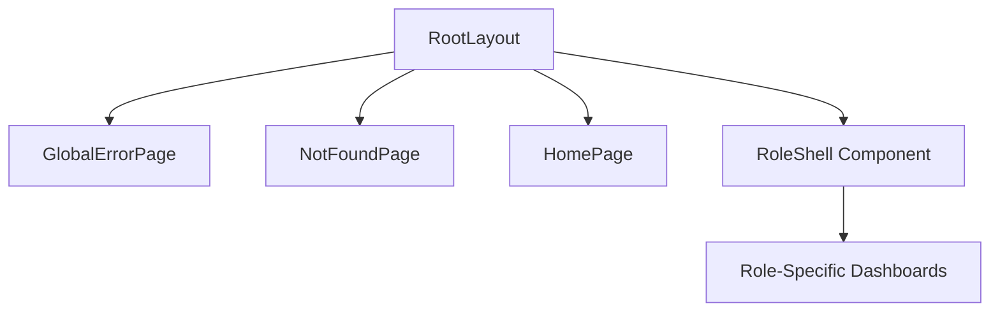

# Core App & Layout

# Core App & Layout

The Core App & Layout module provides the foundational Next.js App Router configuration, global UI shells, and routing definitions for the Sankalp AEI platform. It establishes the global HTML structure, handles application-wide error and 404 states, and provides reusable layout components for role-specific dashboards (Student, Teacher, Parent).

## Architecture Overview



## Routing Configuration (`src/app/routes.ts`)

The module centralizes route definitions to maintain a single source of truth for navigation, authentication requirements, and Role-Based Access Control (RBAC).

*   **`AppRole`**: Defines the core user types: `"STUDENT" | "TEACHER" | "PARENT"`.
*   **`appRoutes`**: An array of `AppRoute` objects. Each route specifies its `path`, `label`, `requireAuth` boolean, and an optional array of allowed `roles`.
*   **`routeGroups`**: A pre-computed object that filters `appRoutes` into `student`, `teacher`, and `parent` arrays. This is highly useful for generating dynamic navigation menus in role-specific layouts.

**Developer Note:** When adding a new page to the application, you must register it in `appRoutes` to ensure it appears in route coverage snapshots and is properly categorized for role-based navigation.

## App Router Core

### Root Layout (`src/app/layout.tsx`)
The `RootLayout` is the top-level wrapper for the entire application. 
*   Injects global CSS (`globals.css` which imports the design system).
*   Configures and injects Next.js optimized fonts: **Inter** (mapped to `--font-sans`) and **Manrope** (mapped to `--font-headline`).
*   Sets the global metadata (Title: "Sankalp AEI").

### Error Handling (`src/app/error.tsx`)
`GlobalErrorPage` is a `"use client"` boundary that catches unexpected runtime errors across the application.
*   Displays a user-friendly fallback UI using the `Card` component.
*   Provides actionable recovery paths: a `reset()` retry button, a link to the Plan Hub, and a support ticket link.
*   **Dev-mode feature:** Conditionally renders the raw `error.message` in a `<pre>` block if `NODE_ENV !== "production"`.

### Not Found (`src/app/not-found.tsx`)
`NotFoundPage` handles 404 states. It provides a search input placeholder and a set of `quickLinks` (Plan Hub, Login, Onboarding, Help Center) to help users recover from dead links.

### Landing Page (`src/app/page.tsx`)
`HomePage` serves as the "Plan Hub" or execution hub. It dynamically renders:
*   A grid of planned outputs (Student Flow, Teacher Flow, etc.).
*   A "Route Coverage Snapshot" generated directly from the `appRoutes` registry.
*   Evaluation criteria for the UI implementation.

## Layout Components

### `RoleShell` (`src/components/layout/RoleShell.tsx`)
`RoleShell` is the primary layout wrapper for all authenticated, role-based pages. It enforces a consistent structural pattern across the app.

**Key Props:**
*   `title` / `subtitle` / `eyebrow`: Populates the hero block at the top of the dashboard.
*   `navItems`: An array of `{ href, label }` objects for the top navigation bar.
*   `activePath`: Used to highlight the current active route in the navigation.
*   `actionLabel` / `actionHref`: Optional props to render a primary call-to-action button in the header (e.g., "Create Intervention").

**Usage Example:**
```tsx
<RoleShell
  title="Student Dashboard"
  subtitle="Track your mission progress."
  navItems={[{ href: "/student/dashboard", label: "Overview" }]}
  activePath="/student/dashboard"
>
  {/* Dashboard content goes here */}
</RoleShell>
```

### `DatabaseState` (`src/components/layout/DatabaseState.tsx`)
A utility component used within dashboards to standardize the UI for asynchronous data fetching. 
*   Accepts `loading`, `error`, and `pathHint` props.
*   Renders a loading `Card` when `loading` is true.
*   Renders an error `Card` prompting the user to connect the database or add content when an `error` string is present.
*   Returns `null` if data is successfully loaded, allowing the main content to render.