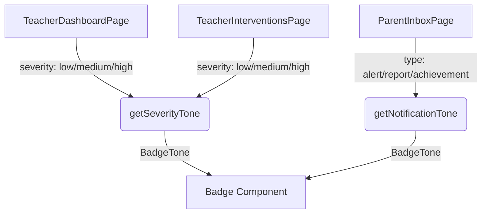

# Design System & UI Components

# Design System & UI Components

The Design System module provides a cohesive set of reusable React components, styling utilities, and CSS variables. It implements a neumorphic (soft UI) design language, utilizing CSS variables for design tokens and a hybrid styling approach that combines global CSS utility classes with dynamic inline styles.

## Architecture & Styling Approach

The design system relies on three core pillars:
1. **CSS Variables (Tokens):** Defined in `design-system.css`, these control colors, spacing, typography, shadows, and transitions.
2. **Utility Classes:** Global classes like `.nm-surface` and `.nm-inset` apply complex neumorphic box-shadows and gradients.
3. **Dynamic Inline Styles:** Components use inline styles for variant-specific or state-driven visual changes, keeping the CSS bundle small and component logic co-located.

### Class Merging (`cn.ts`)
The module uses a custom `cn` utility function that combines `clsx` (for conditional classes) and `tailwind-merge` (for resolving conflicting utility classes). This is heavily used in components like `Button`, `Card`, and `Input` to merge base classes with consumer-provided `className` props.

## Component Library

All components are exported through the barrel file `src/components/design-system/index.ts`.

### `Button`
A highly interactive button component supporting multiple variants and sizes.
* **Props:** Extends standard `HTMLButtonElement` attributes.
* **Variants:** `primary`, `secondary` (default), `danger`, `ghost`. Handled internally by the `getVariantStyle` function.
* **Sizes:** `sm`, `md` (default), `lg`. Maps to specific padding and font sizes via `sizeMap` and `fontMap`.
* **States:** Supports a `loading` boolean which disables the button, reduces opacity, and renders an animated CSS spinner alongside the children.
* **Layout:** Supports a `fullWidth` boolean.

### `Card`
A flexible container component for grouping content.
* **Polymorphism:** Uses the `as` prop to render as an `article` (default), `section`, or `div`.
* **Variants:** `surface` (default, uses `.nm-surface`), `soft` (uses `.nm-surface-soft`), and `inset` (uses `.nm-inset`).
* **Content:** Optionally accepts `title` and `subtitle` props to automatically render a standardized header above the `children`.

### `Input`
A styled text input wrapper.
* **Features:** Automatically links the `<label>` and `<input>` using the provided `id` or falling back to the `name` attribute.
* **Props:** Accepts standard `InputHTMLAttributes` plus optional `label` and `hint` strings.
* **Styling:** Uses the `.nm-inset` class for a recessed neumorphic appearance.

### `Progress`
A linear progress bar component.
* **Props:** Requires `label` and `value`. Optionally accepts `hint` and `tone` (`primary`, `success`, `warning`).
* **Logic:** The `value` is automatically constrained between 0 and 100 using an internal `clamp` function to prevent CSS layout breakage.
* **Animation:** The progress fill uses a CSS transition (`var(--transition-slow)`) for smooth value updates.

### `Badge`
A small status indicator.
* **Tones:** Accepts a `tone` prop (`primary`, `neutral`, `success`, `warning`, `error`) which maps to specific text and background color combinations via the `toneStyles` record.

## Domain Integration & Tone Utilities

To keep domain logic out of the UI components, the module provides `src/lib/tone-utils.ts`. These utilities map application-specific states to standard `BadgeTone` values.

* **`getSeverityTone(severity)`**: Converts risk/severity levels (`low`, `medium`, `high`, `critical`) into appropriate badge tones (e.g., `high` becomes `error`).
* **`getNotificationTone(type)`**: Converts message types (`report`, `alert`, `achievement`) into badge tones (e.g., `achievement` becomes `success`).

## Global CSS (`design-system.css`)

The global stylesheet establishes the foundation for the application's UI:

* **Design Tokens:** Defines `--color-*`, `--space-*`, `--font-size-*`, `--radius-*`, and `--shadow-*` variables on the `:root`.
* **Neumorphic Utilities:** 
  * `.nm-surface`: Extruded surface (standard cards).
  * `.nm-surface-soft`: Softer extruded surface with a gradient background.
  * `.nm-inset`: Recessed surface (inputs, progress bar tracks).
* **Layout Utilities:** Provides grid classes (`.dashboard-grid`, `.card-grid-3`, `.card-grid-2`) and responsive breakpoints that adjust spacing and typography variables for tablet (`max-width: 768px`) and mobile (`max-width: 480px`).
* **Animations:** Includes a `.reveal-up` keyframe animation with staggered delay utilities (`.reveal-delay-1`, etc.) for mounting sequences.