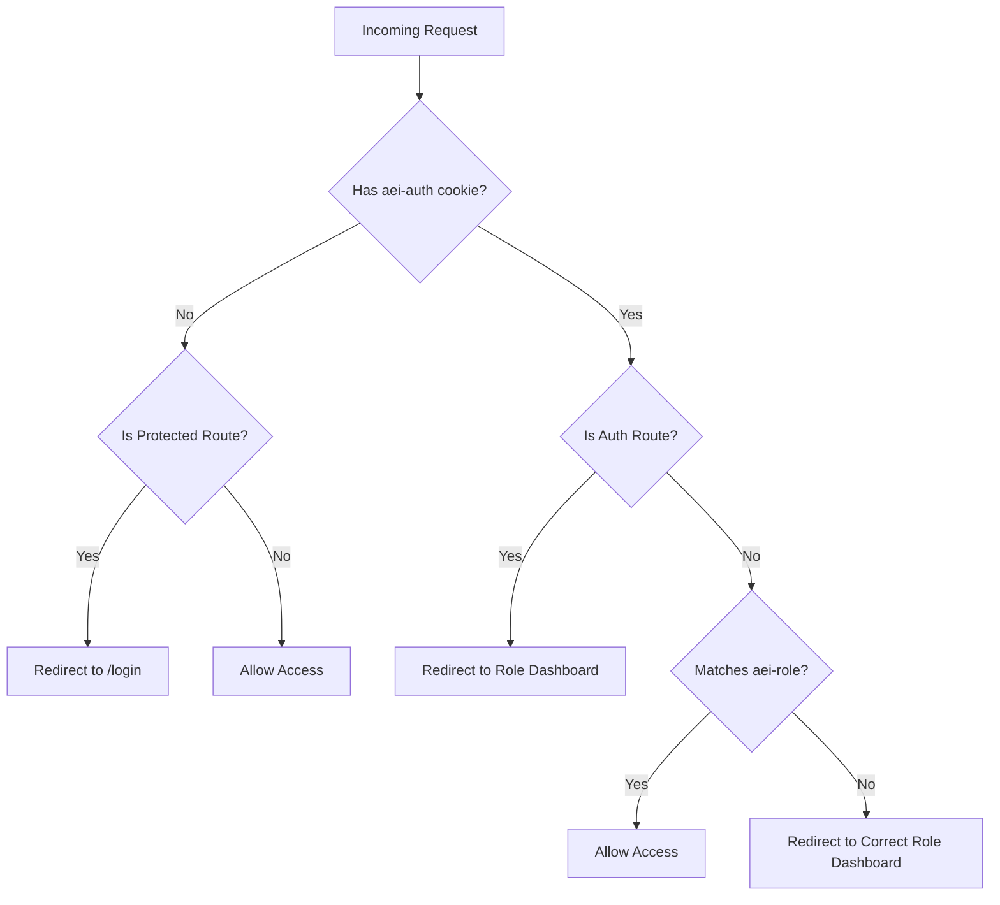

# Other

# Project Configuration & Architecture

This module encompasses the core configuration, deployment settings, routing architecture, and database integration patterns for the Sankalp frontend. It defines how the Next.js application is built, deployed to Firebase App Hosting, and how it interacts with Firestore for role-based content delivery.

## Tech Stack & Configuration

The project is built on a modern React ecosystem, configured via standard tooling files:

*   **Core**: Next.js 15.0.0, React 19.0.0.
*   **State & Forms**: Zustand for global state, React Hook Form with Zod for schema validation.
*   **Styling & UI**: Tailwind CSS, Framer Motion, `class-variance-authority`, `clsx`, and `tailwind-merge`.
*   **Next.js Config (`next.config.js`)**: React strict mode is enabled, and image optimization is disabled (`unoptimized: true`).
*   **TypeScript (`tsconfig.json`)**: Strict mode enabled with path aliases configured for clean imports (e.g., `@/components/*`, `@/lib/*`).
*   **Tailwind (`tailwind.config.ts`)**: The theme is tokenized using CSS variables (e.g., `var(--color-primary)`, `var(--color-accent)`) to support the application's light neumorphic design system.

## Deployment: Firebase App Hosting

The application is configured for deployment on Firebase App Hosting, running on Cloud Run.

### App Hosting Configuration
*   **`apphosting.yaml`**: Configures the Cloud Run environment (0-3 instances, 1 CPU, 512MiB memory) and maps required environment variables for both `BUILD` and `RUNTIME` availability.
*   **`firebase.json`**: Defines the App Hosting backend ID (`aeisankalp`) and specifies ignored directories during deployment.

### Environment Variables
The application requires a standard set of Firebase configuration variables, alongside role-specific defaults and API URLs:
*   `NEXT_PUBLIC_FIREBASE_API_KEY` through `NEXT_PUBLIC_FIREBASE_MEASUREMENT_ID`
*   `NEXT_PUBLIC_API_BASE_URL` (Points to the deployed backend, e.g., Cloud Run URL)
*   `NEXT_PUBLIC_STUDENT_ID`, `NEXT_PUBLIC_TEACHER_ID`, `NEXT_PUBLIC_PARENT_ID` (Used for Firestore document resolution)

## Routing & Access Control

Access control is enforced via Next.js middleware using session cookies, combined with Firebase Authentication.

### Authentication Flow
1.  Users authenticate via Firebase Email/Password in `/login` or `/auth/signup`.
2.  Roles are resolved via Firebase Custom Claims (`role`). If missing, the system falls back to the role selected in the UI.
    *   *Dev Note*: Set claims manually via `npm run auth:set-claims -- <firebase_uid> <STUDENT|TEACHER|PARENT>`.
3.  Session cookies (`aei-auth`, `aei-role`) are set.
4.  Backend API calls (via `src/lib/backend-client.ts`) automatically attach the Firebase ID token as a Bearer token.

### Middleware Enforcement
*   **Unauthenticated**: Redirected to `/login` when attempting to access protected routes.
*   **Authenticated**: Redirected to their respective role dashboard if they attempt to access `/login`, `/auth/signup`, or `/auth/forgot-password`.
*   **Role Mismatch**: Redirected to their correct role's home page if they attempt to access another role's route.

## Database Integration (Firestore)

The frontend relies heavily on direct client-side Firestore reads for page content, rather than fetching HTML or structured data from a backend REST API. 

### Document Paths
Content is scoped by role and user ID (defaulting to the `NEXT_PUBLIC_*_ID` env vars):
*   **Student**: `students/{studentId}/pages/{pageKey}` (e.g., `dashboard`, `insights`, `curriculum`, `assessments`, `ai-companion`)
*   **Teacher**: `teachers/{teacherId}/pages/{pageKey}` (e.g., `dashboard`, `interventions`)
*   **Parent**: `parents/{parentId}/pages/{pageKey}` (e.g., `dashboard`, `inbox`)
*   **Settings**: `users/{uid}/settings/profile` and `users/{uid}/settings/preferences`
*   **Support**: `support_tickets` (filtered by `uid`)

### Fallback & Seeding
*   **`DatabaseState` Component**: If a required Firestore document is missing, the page renders a fallback UI displaying the exact missing document path.
*   **Seed Helpers**: Development utilities exist to populate these documents:
    *   `seedStudentPages("default-student")`
    *   `seedTeacherPages("default-teacher")`
    *   `seedParentPages("default-parent")`

## Shared UI Architecture

To maintain consistency across the 22+ routes, the application utilizes a shared component system:

*   **`RoleShell`**: A unified layout wrapper used across all role pages. It handles the top navigation, active state highlighting, hero section (title, subtitle, eyebrow), and optional hero action buttons.
*   **Design System Primitives**: Reusable components (`Button`, `Card`, `Input`, `Badge`, `Progress`) are strictly typed and styled using the central tokenized theme in `src/styles/design-system.css`.
*   **Tone Utilities**: `src/lib/tone-utils.ts` centralizes tone mapping logic to ensure consistent visual hierarchy (e.g., mapping severity levels to specific colors/badges).