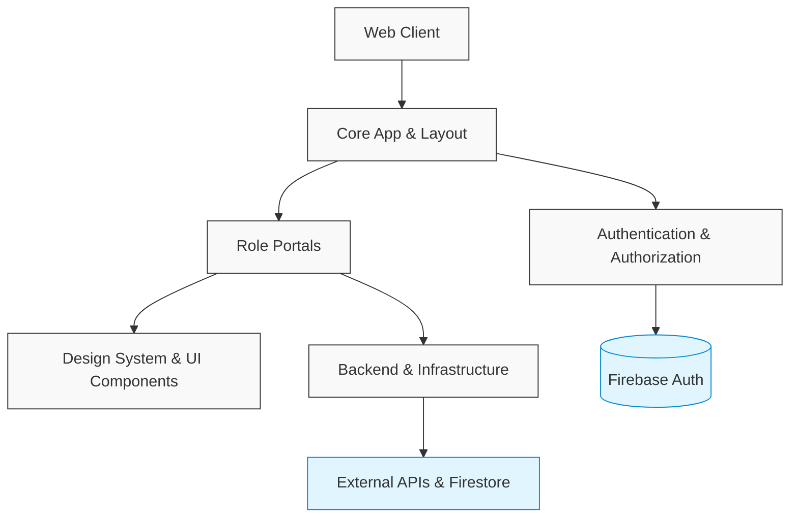

# sankalp-frontend — Wiki

# Sankalp Frontend

Welcome to the Sankalp frontend repository! Sankalp is a modern Student Learning Analytics & Parent Engagement Platform. This Next.js application serves as the primary interface for students, educators, and parents to interact with educational data, track learning progress, and manage their accounts in real time.

## Architecture Overview

The application is built on a modern React ecosystem utilizing Next.js 15, React 19, and Firebase. It relies heavily on real-time data synchronization via Firestore and a secure, Role-Based Access Control (RBAC) system. 

To keep the architecture scalable, the frontend is divided into role-specific portals that share underlying infrastructure, authentication, and design systems.



## Core Workflows & Modules

The entry point to the application is managed by the [Core App & Layout](core-app-layout.md) module, which sets up the Next.js App Router, global error boundaries, and role-specific UI shells. 

### Identity & Access
Security and user identity are handled by the [Authentication & Authorization](authentication-authorization.md) module. It bridges client-side Firebase authentication with Next.js server-side middleware to protect routes. When a new user signs up, they are routed through the [User Settings & Onboarding](user-settings-onboarding.md) flow to select their role (Student, Teacher, or Parent) and configure their application preferences.

### Role-Specific Portals
The core user experience is heavily tailored to the user's role:
*   The [Student Portal](student-portal.md) provides a real-time, database-backed interface featuring dashboards, curriculum tracking, and AI-driven insights. It subscribes directly to Firestore documents to update the UI instantly as new data is processed.
*   The [Teacher & Parent Portals](teacher-parent-portals.md) utilize a Server-Driven UI (SDUI) approach. Instead of hardcoding layouts, page structures and metrics are streamed directly from Firestore, allowing dynamic updates to the educator and guardian experiences without frontend deployments.

### Supporting Systems
Users can manage their subscription plans through the [Billing & Payments](billing-payments.md) module. Under the hood, this checkout flow relies heavily on the [Backend & Infrastructure](backend-infrastructure.md) module to securely attach Firebase ID tokens to backend requests and manage session states. If users encounter issues, they can access the searchable knowledge base and authenticated ticketing system within the [Support & Help](support-help.md) module.

Everything is visually tied together by our [Design System & UI Components](design-system-ui-components.md), which implements a neumorphic (soft UI) design language using CSS variables and reusable React components.

## Getting Started

The project is configured with standard modern tooling, utilizing Zustand for global state and React Hook Form with Zod for schema validation.

### Local Development

1. **Install Dependencies:** Ensure you are using the correct Node version and install the project dependencies.
   ```bash
   npm install
   ```
2. **Start the Development Server:**
   ```bash
   npm run dev
   ```
   The application will be available at `http://localhost:3000`.

### Available Scripts

*   `npm run dev` - Starts the local development server.
*   `npm run build` - Builds the Next.js application for production deployment (optimized for Firebase App Hosting).
*   `npm run start` - Starts the production server locally.
*   `npm run lint` - Runs ESLint to check for code quality issues.
*   `npm run type-check` - Validates TypeScript typings across the project.
*   `npm run test` - Runs the test suite.
*   `npm run test:watch` - Runs the test suite in interactive watch mode.