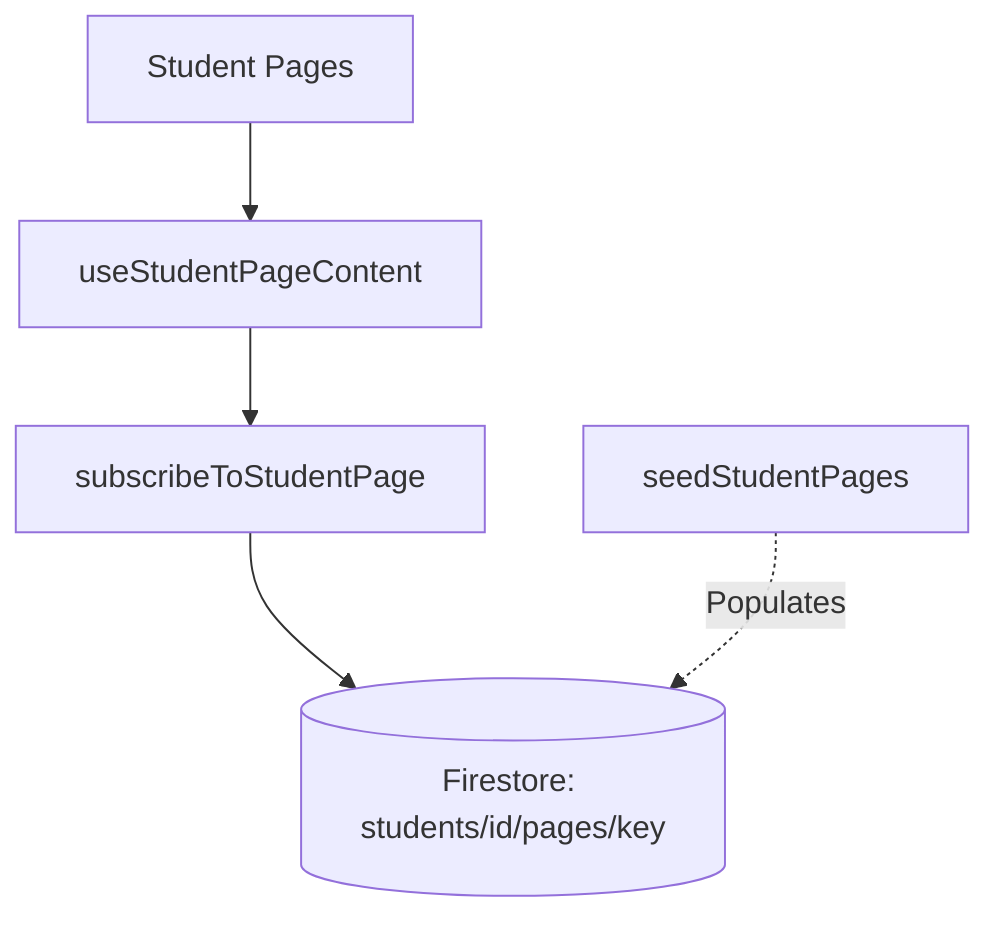

# Student Portal

# Student Portal Module

The Student Portal module provides a real-time, database-backed interface for students to interact with their educational data. It consists of five primary views (Dashboard, Insights, Curriculum, Assessments, and AI Companion) that all share a common data-fetching architecture powered by Firebase Firestore.

## Architecture & Data Flow

The module is designed around a real-time subscription model. Instead of fetching data once on load, pages subscribe to specific Firestore documents. When the database updates (e.g., an AI agent processes a new insight or a teacher updates a curriculum), the student UI updates instantly.



## Core Views

All student pages are located in `src/app/student/` and share a consistent layout structure using the `RoleShell` and `DatabaseState` components. 

*   **Dashboard (`/student/dashboard`)**: Displays the student's current mission, live focus/retention signals, subject mastery progress, and recommended next steps. Uses `StudentDashboardDoc`.
*   **Insights (`/student/insights`)**: Provides a synthesized view of the student's learning trajectory, highlighting mastery trends, subject breakdowns, and AI-generated narratives. Uses `StudentInsightsDoc`.
*   **Curriculum (`/student/curriculum`)**: Shows the current learning block, upcoming schedule, dependency risks (concepts blocking future progress), and Oracle insights for schedule adjustments. Uses `StudentCurriculumDoc`.
*   **Assessments (`/student/assessments`)**: An active assessment interface featuring the current question, confidence scoring, upcoming assessment schedules, and historical results. Uses `StudentAssessmentsDoc`.
*   **AI Companion (`/student/ai-companion`)**: A conversational interface providing adaptive support. It includes quick prompts, a message stream, and live context metrics (e.g., confidence, error patterns). Uses `StudentAiCompanionDoc`.

## Data Management

### The `useStudentPageContent` Hook

The primary way pages interact with data is through the `useStudentPageContent` hook (`src/hooks/useStudentPageContent.ts`). 

```typescript
const { data, loading, error, studentId } = useStudentPageContent<StudentDashboardDoc>("dashboard");
```

**Key Behaviors:**
1.  **Student ID Resolution**: It reads the student ID from the `NEXT_PUBLIC_STUDENT_ID` environment variable, falling back to `"default-student"`.
2.  **Real-time Subscription**: It calls `subscribeToStudentPage` to establish an `onSnapshot` listener to Firestore.
3.  **State Management**: It manages `loading`, `error`, and `data` states, which are passed directly to the `DatabaseState` component to handle UI fallbacks while data is loading or if the document is missing.

### Database Subscription

The `subscribeToStudentPage` function (`src/lib/student-content-db.ts`) handles the actual Firebase interaction. It listens to the document path generated by `getStudentPagePath` (`students/{studentId}/pages/{pageKey}`). If Firebase is not configured, it safely returns an error state rather than crashing the application.

## Data Models

All page data models are defined in `src/lib/student-content.ts`. They share a common base interface for shell configuration:

```typescript
export interface StudentPageMeta {
  brandLabel: string;
  navItems: StudentNavItem[];
  hero: {
    eyebrow: string;
    title: string;
    subtitle: string;
    actionLabel?: string;
    actionHref?: string;
  };
}
```

Each page extends this with its specific content requirements (e.g., `StudentCurriculumDoc` adds `currentBlock`, `schedule`, `dependencyRisks`, and `oracleInsights`).

## Seeding the Database

Because the UI is entirely database-driven, the module includes a seeding utility to populate Firestore with initial state.

*   **`src/lib/student-seed-data.ts`**: Contains the hardcoded `studentSeedPages` object, which holds complete, typed mock data for all five pages.
*   **`src/lib/seed-student-pages.ts`**: Exports the `seedStudentPages(studentId)` function. This iterates over the seed data and writes it to Firestore using `setDoc` with `{ merge: true }`. 

*Note: To view the student portal locally, you must ensure your Firebase environment variables are set and the database has been seeded for the active `NEXT_PUBLIC_STUDENT_ID`.*