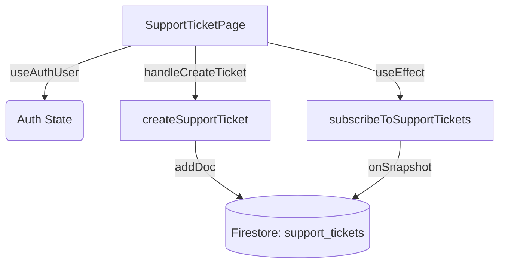

# Support & Help

# Support & Help Module

The Support & Help module provides users with a searchable knowledge base and an authenticated ticketing system to report issues, request assistance, and track the status of their inquiries. It integrates directly with Firebase Firestore for real-time ticket tracking.

## Architecture & Data Flow

The module is split into a public-facing Help Center and an authenticated Support Ticket workspace. The ticketing system relies on a real-time Firestore subscription to keep the user's ticket list up to date without manual refreshing.



## Key Components

### Help Center (`src/app/help/page.tsx`)
The `HelpPage` component serves as the entry point for user support. 
* **Knowledge Base**: Currently utilizes a static array of `articles` covering various categories (Student, Teacher, Parent, Platform, Billing).
* **Search Functionality**: Implements a client-side search using `useMemo`. It filters the `articles` array by checking if the search `query` exists within a concatenated string of the article's category, title, and excerpt.
* **Navigation**: Provides direct links to the Support Ticket workspace (`/support/ticket`).

### Support Ticket Workspace (`src/app/support/ticket/page.tsx`)
The `SupportTicketPage` is an authenticated dashboard where users can submit and track support requests.

* **Authentication**: Uses the `useAuthUser` hook to ensure only logged-in users can create or view tickets. If unauthenticated, the page delegates loading/error states to the `DatabaseState` component.
* **Ticket Creation**: 
  * Maintains a `TicketDraft` state for the form (Subject, Category, Priority, Description).
  * Triggers `handleCreateTicket` on submission, which validates the presence of the user and required fields.
  * Applies `sanitizeText` to the subject (max 120 chars) and message (max 1600 chars). This function strips `<` and `>` characters to prevent basic injection before sending data to the database.
* **Real-time Tracking**: 
  * Uses a `useEffect` hook to call `subscribeToSupportTickets` when the user is authenticated.
  * Renders a list of tickets, utilizing `formatTimestamp` to safely convert Firestore timestamp seconds into a localized date string.

## Database Layer (`src/lib/support-ticket-db.ts`)

The database module handles all interactions with the `support_tickets` Firestore collection. It includes a safety check (`ensureDatabase`) to verify Firebase configuration before executing write operations.

### Data Models

```typescript
type SupportPriority = "LOW" | "MEDIUM" | "HIGH";
type SupportCategory = "TECHNICAL" | "BILLING" | "ACADEMIC" | "ACCESS";

interface SupportTicket {
  id: string;
  uid: string;
  email: string;
  subject: string;
  message: string;
  priority: SupportPriority;
  category: SupportCategory;
  status: "OPEN" | "IN_PROGRESS" | "RESOLVED";
  createdAt?: { seconds: number; nanoseconds: number };
}
```

### API Functions

* **`createSupportTicket(uid, email, payload)`**
  Writes a new document to the `support_tickets` collection. It automatically appends the user's `uid` and `email`, sets the initial `status` to `"OPEN"`, and uses Firestore's `serverTimestamp()` for the `createdAt` field.

* **`subscribeToSupportTickets(uid, onData, onError)`**
  Establishes an `onSnapshot` listener for documents in `support_tickets` where the `uid` matches the provided user ID. 
  * **Sorting Behavior**: Note that sorting is handled *client-side* within the snapshot callback rather than via a Firestore `orderBy` query. It sorts the mapped documents descending by `createdAt.seconds`.
  * Returns an unsubscribe function that is used by `SupportTicketPage` to clean up the listener on component unmount.