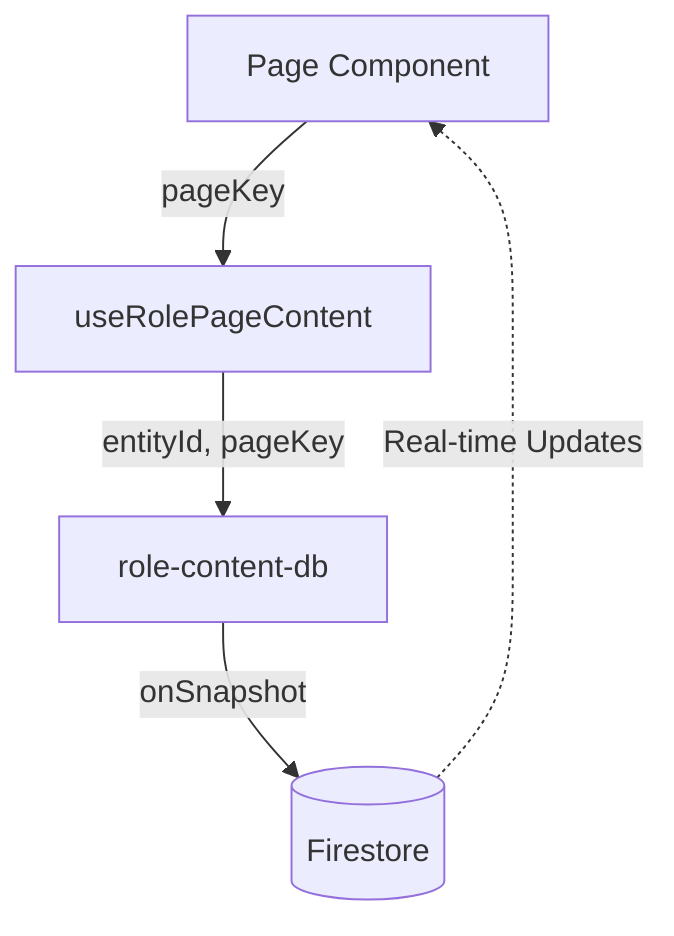

# Teacher & Parent Portals

# Teacher & Parent Portals

The Teacher & Parent Portals module provides role-specific, real-time interfaces for educators and guardians. Instead of hardcoding page content, this module uses a Server-Driven UI (SDUI) approach where page structures, metrics, and notifications are streamed directly from Firestore documents.

## Architecture & Data Flow

The module follows a strict unidirectional data flow from Firestore to the React components, utilizing Firebase's `onSnapshot` for real-time updates.



1. **Page Components** request data for a specific `pageKey` (e.g., `"dashboard"`).
2. **Hooks** (`useTeacherPageContent` / `useParentPageContent`) resolve the current user's ID from environment variables and manage loading/error states.
3. **Database Layer** (`subscribeToPage`) establishes a WebSocket connection to the specific Firestore document.
4. **UI Rendering** uses shared layout components (`RoleShell`, `DatabaseState`) to display the streamed data.

## Key Components

### UI Pages

Pages are thin wrappers that pass a `pageKey` to the data hooks and map the returned JSON document to design system components (`Card`, `Badge`, `Progress`).

**Teacher Portal (`src/app/teacher/`)**
*   `TeacherDashboardPage`: Displays class performance snapshots, at-risk learners, recommended actions, and live notices. Integrates `getSeverityTone` to color-code risk levels.
*   `TeacherInterventionsPage`: Acts as a command center for active student interventions. Displays an active queue, execution protocols, and a daily timeline.

**Parent Portal (`src/app/parent/`)**
*   `ParentDashboardPage`: Shows a high-level snapshot of a child's progress, weekly trend graphs, and recent notifications.
*   `ParentInboxPage`: A dedicated view for reading detailed reports, alerts, and achievements. Integrates `getNotificationTone` for visual categorization.

### Data Hooks

Located in `src/hooks/useRolePageContent.ts`, these hooks abstract the Firebase subscription logic and provide a clean interface for the UI:
*   `useTeacherPageContent<T>(pageKey)`
*   `useParentPageContent<T>(pageKey)`

*Note: Currently, these hooks resolve the active user ID via `NEXT_PUBLIC_TEACHER_ID` and `NEXT_PUBLIC_PARENT_ID` (falling back to `"default-teacher"` and `"default-parent"`).*

### Database Subscriptions

The `src/lib/role-content-db.ts` file handles the actual Firebase interactions. The core function is `subscribeToPage`, which listens to documents at the following paths:
*   Teachers: `teachers/{teacherId}/pages/{pageKey}`
*   Parents: `parents/{parentId}/pages/{pageKey}`

Helper functions `getTeacherPagePath` and `getParentPagePath` (in `src/lib/role-content.ts`) are used to generate path hints for the UI's loading/error states.

## Data Models

All page content is strictly typed in `src/lib/role-content.ts`. Every page document extends `RolePageMeta`, which defines the standard shell configuration:

```typescript
export interface RolePageMeta {
  brandLabel: string;
  navItems: RoleNavItem[];
  hero: {
    eyebrow: string;
    title: string;
    subtitle: string;
    actionLabel?: string;
    actionHref?: string;
  };
}
```

Specific page interfaces (e.g., `TeacherDashboardDoc`, `ParentInboxDoc`) extend this base interface to define the exact arrays and objects expected by the page's specific cards and lists.

## Development & Seeding

Because the UI relies entirely on database documents, the module includes a robust seeding mechanism to populate Firestore with realistic mock data.

*   **Seed Data (`src/lib/role-seed-data.ts`)**: Contains the raw JSON objects for `teacherSeedPages` and `parentSeedPages`. This data includes realistic scenarios like "Declining confidence in 3 sessions" or "Focus streak: 14 days".
*   **Seed Scripts (`src/lib/seed-role-pages.ts`)**: Exposes `seedTeacherPages(teacherId)` and `seedParentPages(parentId)`. These functions iterate over the seed data and use Firebase's `setDoc` with `{ merge: true }` to write the documents to the correct paths without overwriting unrelated fields.