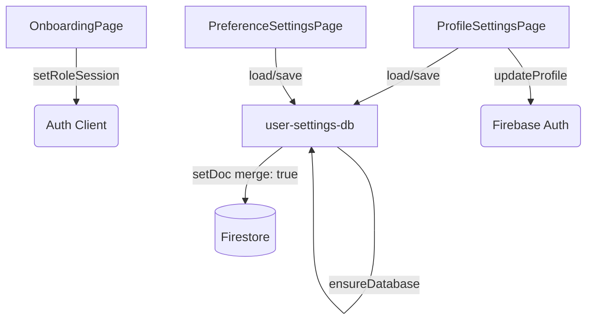

# User Settings & Onboarding

# User Settings & Onboarding

The User Settings & Onboarding module handles the initial user role selection and the management of user-specific configurations. It provides interfaces for users to define their application role (Student, Teacher, Parent), update their personal profile, and customize their application preferences (accessibility, notifications, and theming). 

The module is split into client-side React components and a dedicated Firebase Firestore data layer.

## Architecture & Data Flow



## Key Components

### 1. Onboarding (`src/app/onboarding/page.tsx`)
The `OnboardingPage` component is responsible for routing newly authenticated users to their appropriate dashboard based on their role. 

*   **Execution Flow:** When a user selects a role card, the `handleContinue` function is triggered. This function calls `setRoleSession(role)` (imported from `@/lib/auth-client`) to persist the role selection via cookies, and then uses the Next.js router to push the user to the corresponding target path (`/student/dashboard`, `/teacher/dashboard`, or `/parent/dashboard`).
*   **Roles Supported:** `STUDENT`, `TEACHER`, and `PARENT`.

### 2. Profile Settings (`src/app/settings/profile/page.tsx`)
The `ProfileSettingsPage` allows users to manage their identity, contact information, and privacy controls.

*   **Data Loading:** On mount, it uses the `useAuthUser` hook to get the current user. It then calls `loadUserProfileSettings(user.uid)` to fetch existing data. If no data exists, it falls back to `getProfileDefaults()`.
*   **Sanitization:** Phone numbers are sanitized on input and before saving using the internal `sanitizePhone` function, which strips all characters except `+`, digits, spaces, parentheses, and hyphens, capping the length at 24 characters.
*   **Saving:** The `handleSave` function constructs a `UserProfileSettings` payload. It calls `saveUserProfileSettings` to persist the data to Firestore. Additionally, if the user's `fullName` has changed, it synchronizes this change with Firebase Authentication by calling `updateProfile(user, { displayName: payload.fullName })`.

### 3. Preference Settings (`src/app/settings/preferences/page.tsx`)
The `PreferenceSettingsPage` manages personalized learning goals, notification frequencies, and accessibility controls.

*   **Data Loading:** Similar to the profile page, it waits for `useAuthUser` and then calls `loadUserPreferenceSettings(user.uid)`, falling back to `getPreferenceDefaults()` if necessary.
*   **Saving:** The `handleSave` function trims text inputs (like `learningGoal`, `language`, and `timezone`) to specific character limits before calling `saveUserPreferenceSettings`.

## Data Layer (`src/lib/user-settings-db.ts`)

The data layer abstracts all Firestore interactions for user settings, ensuring consistent paths and safe writes.

### Database Paths
Settings are stored in subcollections under the user's main document:
*   Profile: `users/{uid}/settings/profile`
*   Preferences: `users/{uid}/settings/preferences`

### Core Functions
*   **`ensureDatabase()`**: An internal guard function called before any read/write operation. It verifies that `isFirebaseConfigured` is true and the `db` instance exists, throwing an error otherwise.
*   **`loadUserProfileSettings(uid)` / `loadUserPreferenceSettings(uid)`**: Fetches the respective document. If the `snapshot.exists()` check fails, it returns the default objects (`getProfileDefaults()` or `getPreferenceDefaults()`).
*   **`saveUserProfileSettings(uid, payload)` / `saveUserPreferenceSettings(uid, payload)`**: Writes the payload to Firestore using `setDoc` with the `{ merge: true }` option. This ensures that updates are non-destructive to other fields in the document. It also automatically appends an `updatedAt: serverTimestamp()` field to track modification times.

### Data Models

```typescript
export interface UserProfileSettings {
  fullName: string;
  phone: string;
  timezone: string;
  notificationsEnabled: boolean;
  privacyMode: "standard" | "high";
}

export interface UserPreferenceSettings {
  learningGoal: string;
  notificationFrequency: "immediate" | "daily" | "weekly";
  language: string;
  theme: "system" | "light" | "dark";
  timezone: string;
  largeText: boolean;
  highContrast: boolean;
}
```

## Performance & Security Considerations

*   **Merge Writes:** All database saves use `{ merge: true }`. This allows for small, targeted payloads, reducing network overhead and preventing accidental data overwrites if the schema expands in the future.
*   **Client-Side Truncation:** Text inputs are aggressively trimmed and sliced (e.g., `learningGoal.trim().slice(0, 160)`) before being sent to Firestore to prevent excessively large documents.
*   **Auth Dependency:** Both settings pages strictly require an authenticated user via `useAuthUser`. If `user` is null, the save functions will abort and display an error, preventing unauthenticated database write attempts.